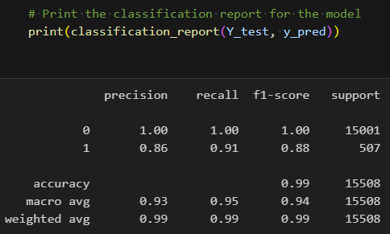

# Module 12 Report Template

## Overview of the Analysis

In this analysis, our primary goal was to develop and evaluate machine learning models for the purpose of assessing the creditworthiness of borrowers. To achieve this, we utilized a dataset consisting of historical lending activity from a prominent peer-to-peer lending services company. The core objective was to predict whether a loan is likely to be repaid, indicating a healthy loan ('0'), or if it carries a substantial risk of not being repaid, categorizing it as a high-risk loan ('1').

The dataset provided information about various features, including borrower characteristics, loan attributes, and the loan's final outcome. The stages of the machine learning process included data preprocessing, model selection (Logistic Regression), and evaluation of model performance.

## Results

Accuracy: 99%

* Class 0:
  * Precision: 100%
  * Recall: 100%
  * F1-score: 100%

* Class 1:
  * Precision: 86%
  * Recall: 91%
  * F1-score: 88%

## Summary

The logistic regression model performs exceptionally well in predicting both healthy loans ('0') and high-risk loans ('1'). The model's precision, recall, and F1-score are perfect (100%) for healthy loans, indicating a high level of accuracy in identifying borrowers likely to repay their loans. For high-risk loans, the model achieves a good balance between precision and recall, suggesting that it can effectively identify loans with a high risk of default.

Overall, the model is well-suited for assessing the creditworthiness of borrowers. Its high accuracy and strong performance metrics make it a recommended choice for the company. However, the choice of the model might depend on the specific problem the company is trying to solve. If the focus is on minimizing the risk of high-risk loans, it might be worth exploring different models or adjusting model parameters to improve precision for class 1 outcomes. 

With an accuracy of 99% this model is well suited for generalized loan risk assessment automation.